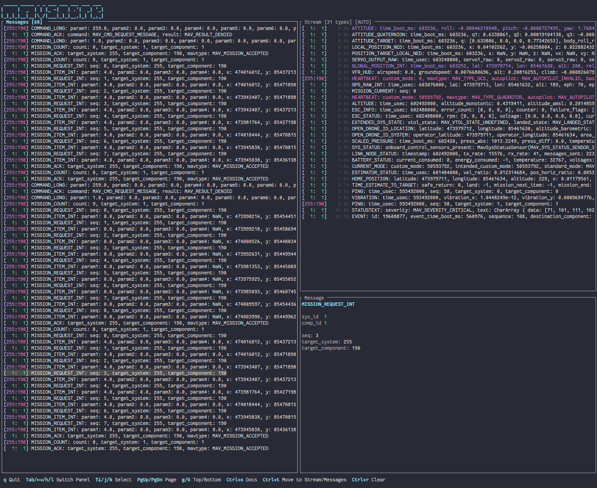

# MAVSNARK



A terminal UI for inspecting [MAVLink](https://mavlink.io/en/) traffic in real time.

## Features

- **Stream panel** — one row per unique message type (keyed by system/component/name), updated in place with seconds since last message
- **Events panel** — chronological log of command, mission, param, and other one-shot messages
- **Message detail panel** — shows all fields of the currently selected message
- Color-coded by system/component ID and message category
- Selection cursor with Vim-style navigation (`j`/`k`, `g`/`G`, `PgUp`/`PgDn`) and `Tab`/arrow keys to switch panels
- `Ctrl+O` opens the MAVLink docs for the selected message
- MAVLink v2, any connection URI supported by the `mavlink` crate (`udpin:`, `tcpin:`, `serial:`, etc.)

# Install

Check [Releases](https://github.com/kloki/mavsnark/releases) for binaries and installers

## Usage

```
mavsnark --uri udpin:0.0.0.0:14445
```

The default URI is `udpin:0.0.0.0:14445`.

## Setup with mavlink-routerd

This setup uses [mavlink-routerd](https://github.com/mavlink-router/mavlink-router) to route MAVLink traffic between PX4 SITL, QGroundControl, and mavsnark. It leverages the Sniffer functionality mof malivnk routerd

### 1. Start PX4 SITL

```
docker run --rm -it --network=host jonasvautherin/px4-gazebo-headless:1.16.1
```

### 2. Start mavlink-routerd

Use the included `mavlink-router.conf`:

```
mavlink-routerd -c mavlink-router.conf
```

This listens on UDP port 14550 for PX4 SITL and forwards traffic to mavsnark on UDP port 5700.

### 3. Connect QGroundControl

1. Open QGroundControl
2. Go to **Application Settings** (Q icon top-left) → **Comm Links**
3. Click **Add** to create a new connection
4. Set **Type** to `TCP`
5. Set **Host Address** to `localhost`
6. Set **TCP Port** to `5760`
7. Click **OK**, select the new link, and click **Connect**

QGroundControl connects directly to PX4 SITL's built-in TCP server. mavlink-routerd picks up the SITL traffic independently via UDP.

### 4. Start mavsnark

```
mavsnark --uri udpin:0.0.0.0:5700 --heartbeat 30
```

The `--heartbeat 30` flag sends a GCS heartbeat with system ID 30, matching the `SnifferSysid` in the router config. This enables mavlink-routerd's sniffer mode, which forwards all routed traffic to mavsnark without mavsnark's heartbeat being forwarded to other endpoints.
